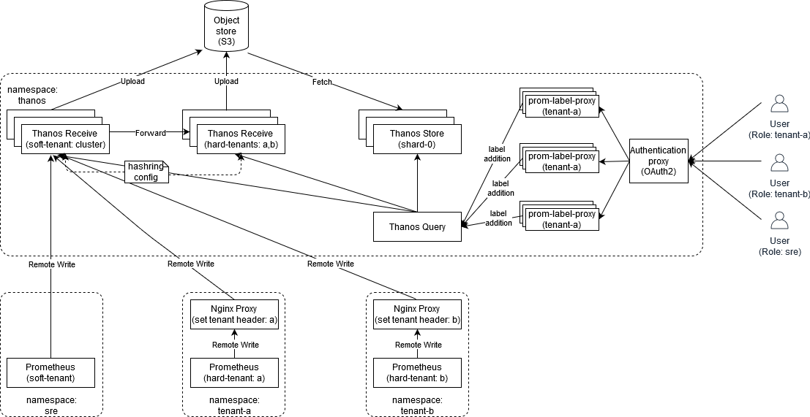
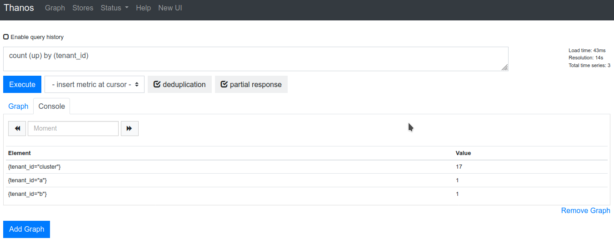

# Introduction

Recently, [Thanos](https://thanos.io) went GA with the [Receiver](https://thanos.io/components/receive.md) component. Recently, we tried this component with one of our clients, it worked well. However, due to lack of documentation, the setup wasn't as smooth as we would have liked to be. Purpose of this blog is to help those who want to try this component in their own setup. In this blog we will try use [Thanos Reciever](https://thanos.io/components/receive.md) to acheive a simple multi-tenant monitoring setup where prometheus can be a near stateless component on the tenant side.

# Architecture
In this blog, we are trying to implement the following architecture. 
<p align="center">
<br>
A simple multi-tenancy model with thanos receive
</p>

The above architecture obviously misses few features that one would also expect from a multi-tenant architecture, e.g: tenant isolation, authentication, etc. This blog only focuses how we can use the [Thanos Reciever](https://thanos.io/components/receive.md) to store time-series from multiple prometheus(es) to acheive multi-tenancy. Also the idea behind this setup is to show how we can make the prometheus on the tenant side nearly stateless yet maintain data resiliency. 
> We will improve this architecture, in the upcoming posts.

# Cluster setup

Clone the repo: 
```
git clone https://github.com/dsayan154/thanos-receiver-demo.git
```

## Setup a local [KIND](https://kind.sigs.k8s.io/docs/user/quick-start/) cluster
1. `cd local-cluster/`
2. Create the cluster with calico, ingress and extra-port mappings: `./create-cluster.sh cluster-1 kind-calico-cluster-1.yaml`
3. Deploy the nginx ingress controller: `kubectl apply -f nginx-ingress-controller.yaml`
4. `cd -`

## Install minio as object storage
1. `kubectl create ns minio`
2. `helm repo add bitnami https://charts.bitnami.com/bitnami`
3. `helm upgrade --install --namespace minio my-minio bitnami/minio --set ingress.enabled=true --set accessKey.password=minio --set secretKey.password=minio123 --debug`
4. Add the following line to */etc/hosts*: `127.0.0.1       minio.local`
5. Login to http://minio.local/ with credentials `minio:minio123`.
6. Create a bucket with name **thanos**

## Install Thanos Components
### Create shared components
  ```
  kubectl create ns thanos

  ## Create a file _thanos-s3.yaml_ containing the minio object storage config for tenant-a:   
  cat << EOF > thanos-s3.yaml
  type: S3
  config:
    bucket: "thanos"
    endpoint: "my-minio.minio.svc.cluster.local:9000"
    access_key: "minio"
    secret_key: "minio123"
    insecure: true
  EOF
  
  ## Create secret from the file created above to be used with the thanos components e.g store, receiver 
  kubectl -n thanos create secret generic thanos-objectstorage --from-file=thanos-s3.yaml
  kubectl -n thanos label secrets thanos-objectstorage part-of=thanos

  ## go to manifests directory
  cd manifests/
  ```

### Install Thanos Receive Controller
- Deploy a thanos-receiver-controller to auto-update the hashring configmap when the thanos receiver statefulset scales: 
    ```
    kubectl apply -f thanos-receiver-hashring-configmap-base.yaml
    kubectl apply -f thanos-receive-controller.yaml
    ```

    The deployment above would generate a new configmap `thanos-receive-generated` and keep it updated with a list of endpoints when a statefulset with label: `controller.receive.thanos.io/hashring=hashring-0` and/or `controller.receive.thanos.io/hashring=default`. The thanos receiver pods would load the `thanos-receive-generated` configmaps in them.
    >NOTE: The __default__ and __hashring-0__ hashrings would be responsible for the soft-tenancy and hard-tenancy respectively.

### Install Thanos Receiver
1. Create the thanos-receiver statefulsets and headless services for soft and hard tenants.
   > We are not using persistent volumes just for this demo.
   ```
   kubectl apply -f thanos-receive-default.yaml
   kubectl apply -f thanos-receive-hashring-0.yaml
   ```
   > The receiver pods are configured to store 15d of data and with replication factor of 2
2. Create a service in front of the thanos receive statefulset for the soft tenants.
   ```
   kubectl apply -f thanos-receive-service.yaml
   ```
   > The pods of **thanos-receive-default** statefulset would load-balance the incoming requests to other receiver pods based on the hashring config maintained by the thanos receiver controller.
### Install Thanos Store
1. Create a thanos store statefulsets. 
   ```
   kubectl apply -f thanos-store-shard-0.yaml
   ```
   > We have configured it such that the thanos query only fans out to the store for data older than 2w. Data earlier than 15d are to be provided by the receiver pods. P.S: There is a overlap of 1d between the two time windows is intentional for data-resilency.
### Install Thanos Query
1. Create a thanos query deployment, expose it through service and ingress
   ```
   kubectl apply -f thanos-query.yaml
   ```
   > We configure the thanos query to connect to receiver(s) and store(s) for fanning out queries.

## Install Prometheus(es)
#### Create shared resource
```
kubectl create ns sre 
kubectl create ns tenant-a
kubectl create ns tenant-b
```
## Install Prometheus Operator and Prometheus
We install the [prometheus-operator](https://github.com/prometheus-operator/prometheus-operator) and a default prometheus to monitor the cluster
```
helm upgrade --namespace sre --debug --install cluster-monitor stable/prometheus-operator --set prometheus.ingress.enabled=true --set prometheus.ingress.hosts[0]="cluster.prometheus.local" --set prometheus.prometheusSpec.remoteWrite[0].url="http://thanos-receive.thanos.svc.cluster.local:19291/api/v1/receive" --set alertmanager.ingress.enabled=true --set alertmanager.ingress.hosts[0]="cluster.alertmanager.local" --set grafana.ingress.enabled=true --set grafana.ingress.hosts[0]="grafana.local"
```
## Install Prometheus and ServiceMonitor for tenant-a
In _tenant-a_ namespace:
- we deploy a nginx proxy to proxypass the requests from prometheus to _thanos-receive_ service in _thanos_ namespace
```
   kubectl apply -f nginx-proxy-a.yaml
```
- we create a [prometheus](https://coreos.com/operators/prometheus/docs/latest/api.html#prometheus)  and a [servicemonitor](https://coreos.com/operators/prometheus/docs/latest/api.html#servicemonitor)  to monitor itself
```
   kubectl apply -f prometheus-tenant-a.yaml
```

## Install Prometheus and ServiceMonitor for tenant-b
In _tenant-b_ namespace:
- we deploy a nginx proxy to proxypass the requests from prometheus to _thanos-receive_ service in _thanos_ namespace
```
   kubectl apply -f nginx-proxy-b.yaml
```
- we create a [prometheus](https://coreos.com/operators/prometheus/docs/latest/api.html#prometheus) and a [servicemonitor](https://coreos.com/operators/prometheus/docs/latest/api.html#servicemonitor) to monitor itself
```
   kubectl apply -f prometheus-tenant-b.yaml
```

### Add some extra localhost aliases
Add the following lines to `/etc/hosts` :
```
127.0.0.1       minio.local
127.0.0.1       query.local
127.0.0.1       cluster.prometheus.local
127.0.0.1       tenant-a.prometheus.local
127.0.0.1       tenant-b.prometheus.local
```
The above would allow you to locally access the [**minio**](http://minio.local), [**thanos query**](http://query.local), [**cluster monitoring prometheus**](http://cluster.prometheus.local), [**tenant-a's prometheus**](http://tenant-a.prometheus.local), [**tenant-b's prometheus**](http://tenant-b.prometheus.local). We are also exposing alertmanager and grafana, but we don't require those in this demo.

### Test the setup
Access the thanos query from http://query.local/graph and from the UI, execute the query `count (up) by (tenant_id)`. We should see a following output:
<p align=center>
<br>
Query Output
</p>
Otherwise, if we have `jq` installed, you can run the following command:

```
$ curl -s http://query.local/api/v1/query?query="count(up)by("tenant_id")"|jq -r '.data.result[]|"\(.metric) \(.value[1])"'
{"tenant_id":"a"} 1
{"tenant_id":"b"} 1
{"tenant_id":"cluster"} 17
```
Either of the above outputs show that, *cluster*, *a* and *b* prometheus tenants are having 17, 1 and 1 scrape targets up and running. All these data are getting stored in thanos-receiver in real time by prometheus' [remote write queue](https://prometheus.io/docs/practices/remote_write/#remote-write-characteristics).
